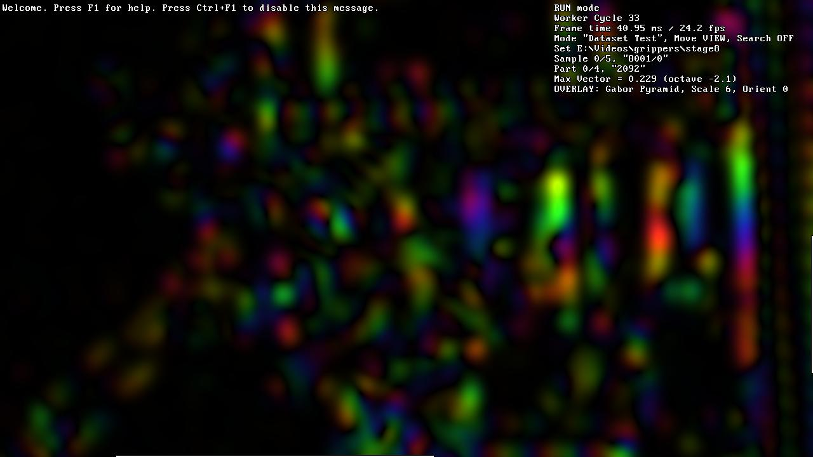

EN [RU](ui.ru.md)

User Interface
===============

Config
=======

The config is stored in a JSON file with the name of the algorithm module,
for example, "my-algo.json".

Upon startup, the shell looks for it in the current directory. If the config is
not found, the shell creates it using default values, and if some parameters are
missing, the shell adds them with default values.

For convenience, it's important to configure the "Text Editor" parameter. This
way, during operation, config editing (key: "`", Tilde) and global log viewing
(key: Shift+Tilde) will be available. The most convenient editor is the one that
remembers the last position and can highlight JSON syntax.

The config stores parameters for both the graphical shell and the applied
algorithm module.

Window View
===========

The main debug image occupies most of the window. It is displayed by the
algorithm module and can have any application-specific meaning.

When the main debug image does not fit in the window, the shell displays
scrollbars. You can scroll the image by grabbing any part of the window with the
mouse and dragging it.

Global log messages are displayed directly over the image and then disappear
(config parameter "Message Display Time In Seconds").
The global log is written to a file with the name of the algorithm module,
for example, "my-algo.log". You can view it using the Shift+Tilde key.
The config parameter "Clear Log On Start" determines whether the file will be
cleared on startup.

The local log, which contains the output of each processing cycle of the
algorithm module, is displayed on the right. You can change the width of the
local log by holding Shift, grabbing any part of the window with the mouse,
and dragging it.

How many times can you say it?

Window Modes
============

In addition to the usual window modes "minimized / normal / maximized", there are
also Fullscreen (Alt+Enter key) and the so-called Maxscreen (F11 key) -
a convenient mode in which the window is maximized and has no title. It is similar
to Fullscreen, but the OS taskbar remains visible.

Toggle the title display with the Alt+F11 key.

The F2 key toggles the V-Sync mode — synchronizing window rendering
with the display frequency.

You can close the window with the F10 key.

Using the Mouse
================

You can scroll the main debug image with the mouse by dragging,
and resize the local console by dragging with the Shift key held down.

The mouse position in the main debug image, as well as the signals of pressing and releasing its
buttons are passed to the algorithm module, which uses them at its discretion to display
application information.

The "Worker By Mouse" config parameter sets the level of mouse events that trigger
the execution of the algorithm module cycle: "none", "press", "press and release" or
"all: press, release, and move".

Algorithm Module Cycles
=======================

The algorithm module runs in a separate thread to avoid blocking the user interface.

You can toggle its operation mode with the F5 key:
* RUN: Continuous execution of cycles one after another.
* STEP: Cycles are executed explicitly by pressing "F8" or by mouse events if
  allowed by the "Worker By Mouse" config parameter.

Shell Hotkeys
=============

You can view the list of shell hotkeys with the F1 key.

| Key           | Action                                                    |
|---------------|-----------------------------------------------------------|
| ` (Tilde)     | Edit config.                                              |
| Shift+Tilde   | View global log.                                          |
| Alt+Enter     | Toggle Fullscreen mode.                                   |
| F11           | Toggle Maxscreen mode: maximized window without title bar.|
| Alt+F11       | Toggle window title bar display.                          |
| F2            | Toggle V-Sync: window rendering synchronization with display frequency. |
| F1            | Display brief help and shell keys.                        |
| Alt+F1        | Display algorithm module keys.                            |
| F5            | Toggle continuous operation mode of the algorithm module. |
| F8            | Execute one cycle of the algorithm module.                |
| F10           | Exit the program.                                         |

Algorithm Module Hotkeys
========================

Although the algorithm module's hotkeys are determined by the module itself,
hexlib has some conventionally accepted signals.

Here's a list of them. Keys are indicated by convenient labels on them,
Ctrl/Alt/Shift modifiers are required only if explicitly stated.

| Keys          | Action                                                    |
|---------------|-----------------------------------------------------------|
| \\            | Stop visualization output.                                |
| A             | Toggle alternative version of the algorithm.              |
| Ctrl+D        | Cycle visualization scaling mode.                         |
| Numpad- or Alt+Minus   Numpad+ or Alt+Plus   Numpad* or Alt+Zero | Change visualization brightness or reset it. |
| - +           | Change scale, for example, pyramid level.                 |
| ( )           | Switch cameras or views.                                  |
| ; ' (two keys to the left of Enter) | Change circular index, e.g., filter orientation. |
| < >           | Change temporal index, e.g., frame index in history.      |
| [ ]           | Change processing stage index.                            |
| Alt+C         | Cycle channel for multi-channel images.                   |
| Alt+I         | Toggle interpolation mode for visualization.              |
| Ctrl+Q        | Toggle modulation for complex images.                     |
| Z X C V       | Display mode for complex images:  color, amplitude, X-part, Y-part. |
| Shift+Alt+B   | Toggle saving visualization to .bmp files (config section "Saving BMP Files"). |
