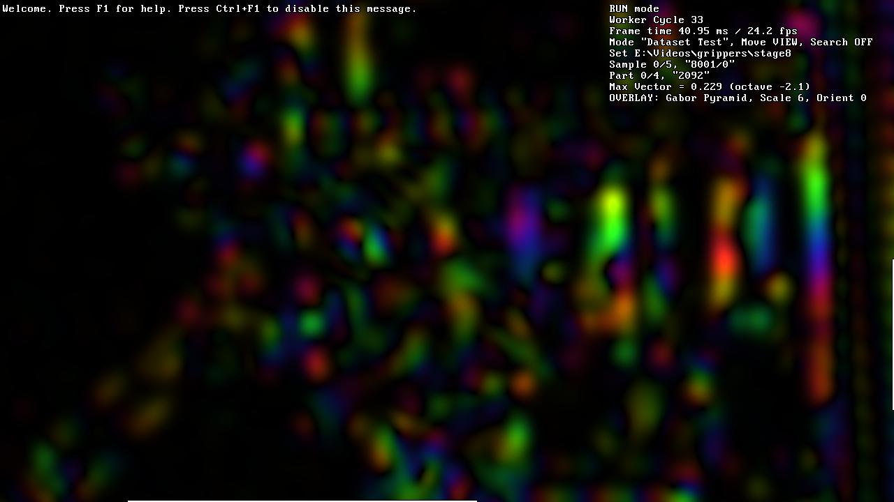

[EN](ui.en.md) RU

Пользовательский интерфейс
==========================

Конфиг
======

Конфиг хранится в JSON-файле с именем модуля алгоритма, например,
"my-algo.json".

При запуске оболочка ищет его в текущем каталоге. Если конфига нет, то оболочка
его создаёт, используя значения по умолчанию, а если нет части параметров, то
оболочка их добавляет со значениями по умолчанию.

Для удобства важно настроить параметр "Text Editor". Тогда в процессе работы
будут доступны редактирование конфига (клавиша "\`", Тильда) и просмотр
глобального лога (клавиша Shift+Тильда). Удобнее всего редактор, который
запоминает последнюю позицию и умеет подсвечивать синтаксис JSON.

В конфиге хранятся параметры как графической оболочки, так и прикладного модуля
алгоритма.

Вид окна
========

Большую часть окна занимает главная отладочная картинка. Её выводит модуль
алгоритма и она может иметь любой прикладной смысл.

Когда главная отладочная картинка не помещается в окно, оболочка показывает
скроллбары. Можно скроллить картинку, хватая мышкой за любое место окна и
перетаскивая его.

Сообщения глобального лога выводятся прямо поверх картинки, а затем исчезают
(параметр конфига "Message Display Time In Seconds").
Глобальный лог пишется в файл с именем модуля алгоритма, например, "my-algo.log".
Его можно просмотреть клавишей Shift+Тильда.
Параметр конфига "Clear Log On Start" определяет, будет ли файл очищаться при запуске.

Справа отображается локальный лог, в котором содержится вывод каждого цикла
обработки модуля алгоритма. Можно менять ширину локального лога с зажатым
Shift-ом, хватая мышкой за любое место окна и перетаскивая его.

Режимы окна
===========

Кроме обычных режимов окна "минимизированное / нормальное / максимизированное", есть
ещё Fullscreen (клавиша Alt+Enter) и так называемый Maxscreen (клавиша F11) —
удобный режим, в котором окно максимизировано и не имеет заголовка. Это похоже
на Fullscreen, но остаётся видимой панель задач ОС.

Переключать отображение заголовка можно клавишей Alt+F11.

Клавиша F2 переключает режим V-Sync — синхронизацию отрисовки окна
с частотой дисплея.

Закрыть окно можно клавишей F10.

Использование мыши
==================

Мышью можно скроллить главную отладочную картинку с помощью перетаскивания,
а также менять размер локальной консоли перетаскиванием с зажатым Shift-ом.

Позиция мыши в главной отладочной картинке, а также сигналы нажатий и отпусканий её
кнопок передаются модулю алгоритма, который использует их по своему усмотрению для вывода
прикладной информации.

Параметр конфига "Worker By Mouse" задаёт уровень событий мыши, которые вызывают
выполнение цикла модуля алгоритма: "никакие", "нажатие", "нажатие и отпускание" или
"все: нажатие, отпускание и движение".

Циклы модуля алгоритма
======================

Модуль алгоритма работает в отдельном потоке, чтобы не блокировать пользовательский интерфейс.

Клавишей F5 можно переключать его режим работы:
* RUN: Непрерывное выполнение циклов один за другим.
* STEP: Циклы выполняются явно нажатием "F8" или по событиям мыши, если
  это разрешено в параметре конфига "Worker By Mouse".

Горячие клавиши оболочки
========================

Посмотреть список горячих клавиш оболочки можно клавишей F1.

| Клавиша       | Действие                                                  |
|---------------|-----------------------------------------------------------|
| \` (Тильда)   | Редактирование конфига.                                   |
| Shift+Тильда  | Просмотр глобального лога.                                |
| Alt+Enter     | Переключение режима Fullscreen.                           |
| F11           | Переключение режима Maxscreen: максимизированного окна без заголовка. |
| Alt+F11       | Переключение отображения заголовка окна.                  |
| F2            | Переключение V-Sync: синхронизации отрисовки окна с частотой монитора. |
| F1            | Отображение краткой справки и клавиш оболочки.            |
| Alt+F1        | Отображение клавиш модуля алгоритма.                      |
| F5            | Переключение режима непрерывной работы модуля алгоритма.  |
| F8            | Выполнение одного цикла модуля алгоритма.                 |
| F10           | Выход из программы.                                       |

Горячие клавиши модуля алгоритма
==========================================

Хотя клавиши модуля алгоритма определяются им по своему усмотрению,
в hexlib есть некоторые условно принятые сигналы.

Вот их перечень. Клавиши указаны по удобным обозначениям на них,
модификаторы Ctrl/Alt/Shift требуются только если они явно написаны.

| Клавиши       | Действие                                                  |
|---------------|-----------------------------------------------------------|
| \\            | Прекращение вывода визуализации.                          |
| A             | Включение/выключение альтернативной версии алгоритма.     |
| Ctrl+D        | Переключение режима масштабирования визуализации.         |
| Numpad- или Alt+Минус   Numpad+ или Alt+Плюс   Numpad* или Alt+Ноль | Изменение яркости визуализации или её сбрасывание. |
| - +           | Изменение масштаба, например, уровня пирамиды.            |
| ( )           | Переключение камер или видов.                             |
| ; ' (две клавиши слева от Enter) | Изменение кругового индекса, например, ориентации фильтра. |
| < >           | Изменение временн*o*го индекса, например, индекса кадра в истории. |
| [ ]           | Изменение условного индекса стадии обработки.             |
| Alt+C         | Переключение канала для многоканальных изображений.       |
| Alt+I         | Включение/выключение режима интерполяции визуализации.    |
| Ctrl+Q        | Включение/выключение модуляции для комплексных изображений. |
| Z X C V       | Режим отображения комплексных изображений:  цветной, амплитуда, X-часть, Y-часть. |
| Shift+Alt+B   | Включение/выключение записи визуализации в .bmp-файлы (секция конфига "Saving BMP Files"). |
